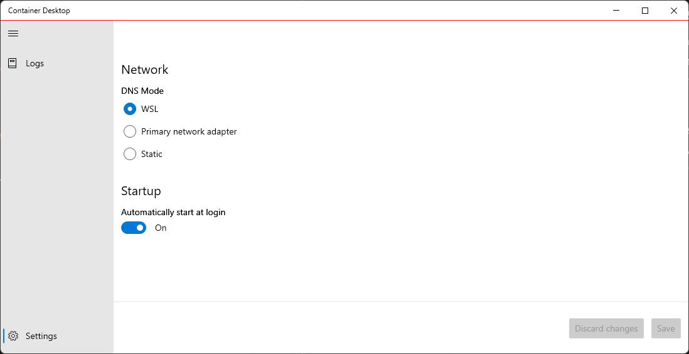

# DNS Mode configuration 

This page contains information on how to view and change the DNS settings for Container Desktop. By default the WSL2 automatically sets the IP-address of the virtual ethernet adapter of the host in the /etc/resolv.conf. The resolv.conf contains a list of DNS servers that are capable of resolving a given hostname to its IP used by the Container-Desktop docker-engine.  

Container Desktop makes it possible to deviate from the standard WSL2 DNS behavior, by allowing to use the DNS server(s) of the primary network adapter (which updates automatically when DNS addresses change) or by manually specifying one or more DNS server addresses.

The reason why this option is built-in is primarily because the stability and/or correct operation of the standard WSL2 DNS configuration, which cannot be guaranteed in all environments or situations (see [open DNS issues reported on WSL2](https://github.com/microsoft/WSL/issues?q=is%3Aissue+is%3Aopen+DNS)).

You can configure the DNS mode via the system tray application by selecting the ***Settings*** option. Under the Network section you find the three available DNS Modes. Select the mode and select ***Save*** to enable the new DNS configuration for Container Desktop.

>***Note:*** You can review the Container Desktop DNS mode changes with the ***View log stream*** option.  