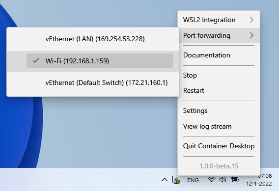

# Port forwarding 

This page contains information on how to expose containers to an external network by using Port forwarding.

## Port Forwarding feature

Container Desktop provides a feature to expose containers on a specific network. By default, no containers are only accessible on the localmachine (localhost) and not from any other network interface. With the _***Port forwarding***_ feature you can bind the container ports to a specific network interface. This allows other network clients to access the running containers. As a user you need to configure the firewall to allow inbound traffic to the containers. 

## Example Scenario
In this example scenario we are going to publish an nxing container on HTTP/80 on an external network interface. The example scenario contains the following steps 

1. Run nginx container on Port 80
2. Enable Port forwarding in COntainer Desktop
3. Configure the Windows Firewall

### Run nginx container on port 80

First, we run an nginx container with the -p argument to publish it on port 80, for example:

```
docker run -p 80:80 -d nginx
```

By default, Container Desktop makes whatever is running on port 80 in the container available on port 80 of localhost (in this case nginx). This meens only connections to localhost:80 are sent to port 80 in the container, and it is not accesible from any other network interface. 

>Note: In this example, the host and container ports are the same. In the example port 80 is used if this port is allready in use you can specify a different external port, for exampl ```docker run -p 8000:80 -d nginx``` (here port 8080 is used).

Open your browser and open http://localhost, the default "Welcome to nginx!" page should be shown. 

### Enable Port Forwarding
Now we can pusblish the running containers, in this case nginx on port 80, to a specific network interface. Select the ***Port forwarding***_ option in the Container Desktop system tray application, and select the network interface that you want to use: 




Container Desktop binds the adapter to listen to the container ports that are published.

### Configure firewall

To allow external connections we need to open the firewall to accept inbound traffic on the used ports.

1. Open PowerShell with administrator privileges
2. Create a new Firewall inbound rule to accept inbound traffic on port 80
```
New-NetFirewallRule -DisplayName "Container-Desktop-Example" -Direction Inbound -Profile Private -Protocol TCP -LocalPort 80
```
> Note: In this example the firewall profile "Private" is used. Depending on the connectednetwork you may need to specify a different profile (Domain/Public). 

Open a browser on a different machine that is connected to the same network and open http://<external ip adress>, the default "Welcome to nginx!" page should be shown.


## Clean-up  

After fowllowing the example configuration, please remove the the example configuration 

### Remove Firewall configuration: 

1. Open PowerShell with administrator privileges
2. Remove the Container-Desktop-Example firewall rule 

```
Remove-NetFirewallRule -DisplayName "Container-Desktop-Example"
```

### Disable Port Forwarding

Disable the port fowarding option in container desktop by deselecting the interface in the ***Port forwarding*** option of the Container Desktop system tray application. 